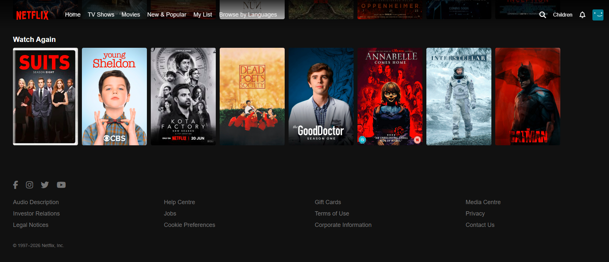

# Netflix Clone

A responsive front-end clone of the Netflix streaming platform built using HTML, CSS, and JavaScript.  
This project demonstrates the ability to recreate a real-world production UI with clean structure, smooth interactions, and responsive design, making it suitable for portfolio, resume, and internship applications.

## Project Overview

The Netflix Clone replicates the visual design and core interaction patterns of the official Netflix web interface.  
It focuses on frontend fundamentals such as layout structuring, component-based styling, DOM manipulation, and user interaction handling without using any external frameworks or backend services.

The project is fully client-side and emphasizes writing clean, readable, and maintainable code while closely matching an industry-grade UI.


## Project Screenshots

**Hero Banner and Navigation**  


**Trending Now Section**  


**Watch Again Section**  


All screenshots are taken directly from the working project and are stored inside the `screenshots` folder at the root of the repository.


## Key Features

- Netflix-style fixed navigation bar with menu items and action icons  
- Large hero banner highlighting featured content with Play and More Info actions  
- Horizontally scrollable rows for movies and series  
- Hover-based card animations to enhance user experience  
- Video modal that plays a trailer and supports keyboard-based closing  
- Fully responsive layout optimized for desktop and smaller screen sizes  
- Clean and organized folder structure for assets and screenshots  


## Technologies Used

- **HTML5**
  Used to structure the application and define semantic layout components.

- **CSS3**  
  Used for styling, layout design, animations, transitions, and responsive behavior using modern CSS techniques.

- **JavaScript (Vanilla JS)**  
  Used to handle user interactions including button events, modal open and close logic, keyboard controls, and video playback.

- **Font Awesome**  
  Used to implement scalable vector icons in the navigation bar and footer.


## Usage and Applications

This project can be used as:

- A frontend portfolio project  
- A resume project demonstrating UI and JavaScript fundamentals  
- Practice for HTML, CSS, and JavaScript concepts  
- A UI reference for streaming platform designs  
- A base template for future enhancements such as backend integration or framework migration  


## Getting Started

Follow the steps below to run the project locally.


## Prerequisites

- Any modern web browser such as Chrome, Edge, or Firefox  
- Windows, macOS, or Linux operating system  
- A code editor such as Visual Studio Code  


## Installation

Clone the repository and navigate to the project directory:

```bash
git clone https://github.com/KhushiVig/netflix-clone.git
cd netflix-clone
````

Ensure the following folder structure is maintained:

* Image assets inside `assets/images/`
* Video files inside `assets/videos/`
* Project screenshots inside `screenshots/`

No additional setup or configuration is required.


## Running the Project

Open the `index.html` file directly in any modern web browser.
For a better development experience, you can also use Live Server in Visual Studio Code.

No terminal command is required to run the application.


## Common Issues and Troubleshooting

* **Images not loading**
  Verify that relative paths inside the assets folders are correct.

* **Video not playing**
  Ensure the video file exists and is in MP4 format.

* **Icons not appearing**
  Check your internet connection, as Font Awesome is loaded via CDN.

* **Modal not closing**
  Use the close button or press the Escape key.


## Version History

**Version 0.2**
Added video modal functionality, improved responsiveness, and enhanced hover animations.

**Version 0.1**
Initial release with static layout and core UI sections.


## Author

**Khushi Vig**
GitHub: [https://github.com/KhushiVig](https://github.com/KhushiVig)


## Acknowledgments

Netflix for UI and design inspiration
Font Awesome for icons
MDN Web Docs
Open-source frontend learning resources


